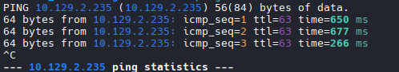
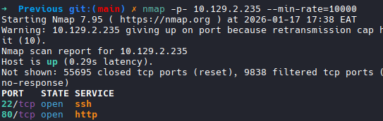
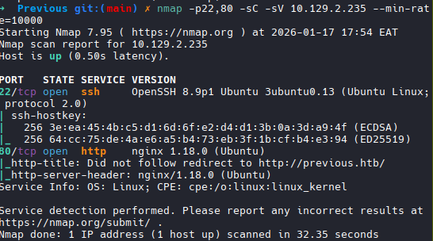
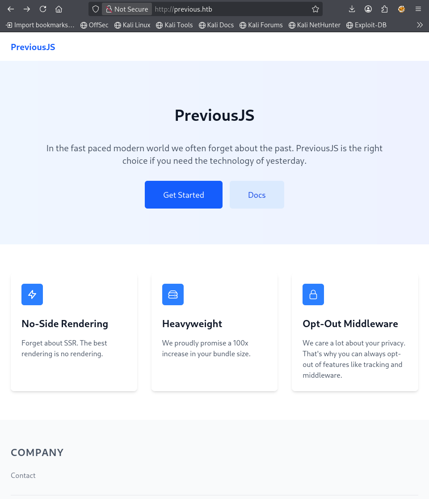
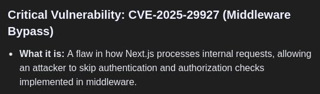
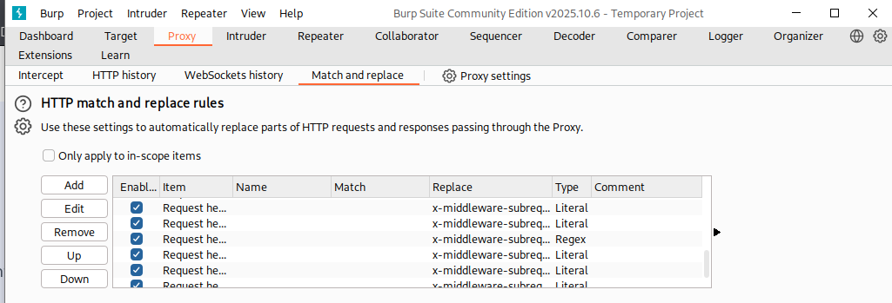
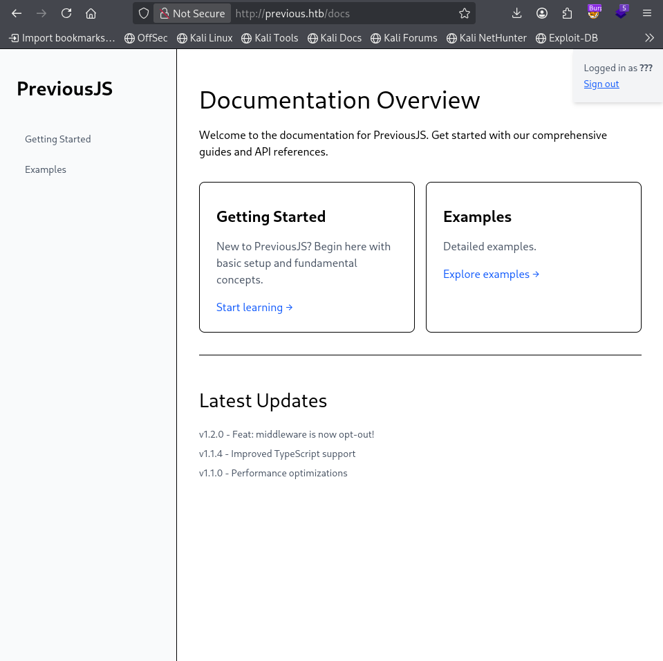
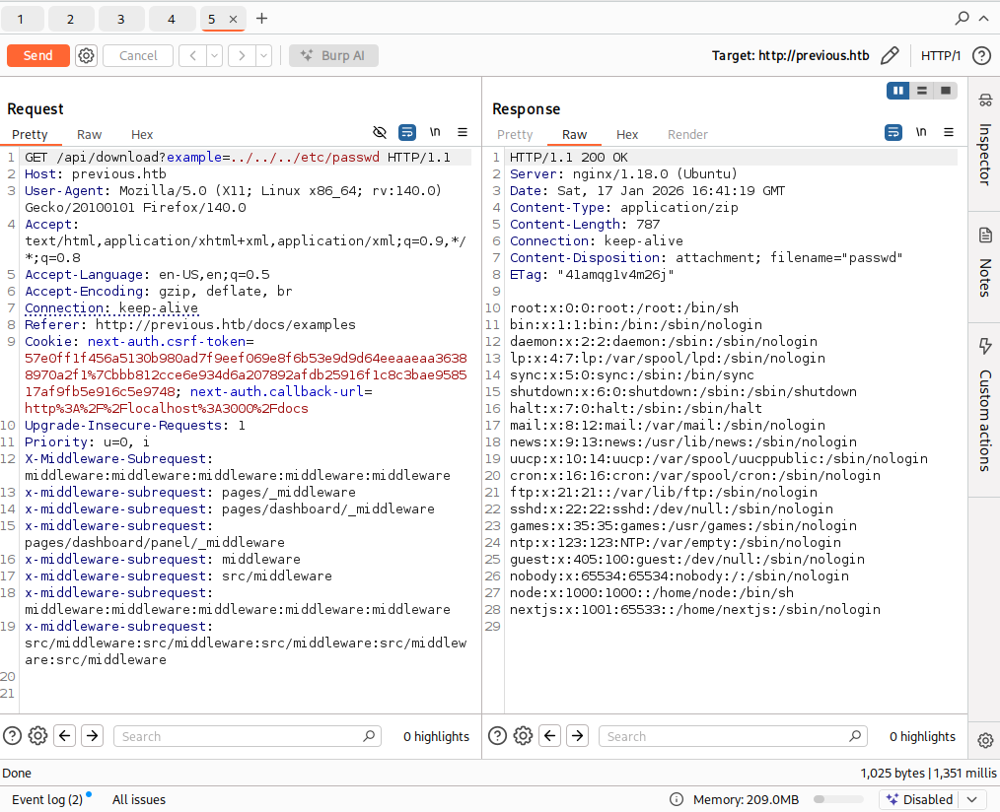
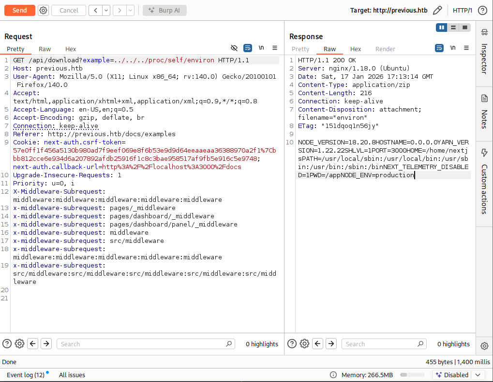

# Previous
To study our approach we are going to start with a retire 
box previous. This will help in acquiring a basic understanding
of what tools are used and how we approach a target. With this knowledge we will be ready to try out our first box on our own.

* Currently the box is available on the IP address 10.129.2.235.

### *Lesson* 
* What is an IP address?
     - An IP address is a unique identification number assigned to every 
device on the internet. As you read this your device is connected to the internet so it has an IP address.
You can confirm your IP address by running the command *ifconfig* on Linux or *ipconfig* on Windows. Depending on the type of network you are using the IP address of your computer will show up. 

     - To see if we can reach the machine across the internet we use the ping command as *ping 10.129.2.235*. The ping command uses the ICMP (Internet Control Protocol) to send a ICMP Echo Request packet to the specified destination. If the machine is online and reachable it responds with an
ICMP Echo Reply message

* What is ICMP
     - It is a network layer protocol of the OSI model used to report errors and diagnose network issues. It allows network devices to send
feedback (ICMP Echo Reply message) about packet delivery failure. It is also used by the command *tracroute 10.129.2.235* to trace the path a packet takes before reaching its destination

     - 

     - Using the above information we can now understand what our ping command output is saying.
With our target up and reachable we need to perform some orientation

### *Orientation*
* The goal here is not deep scanning it is to understand what king of system we are targeting.
     - The main questions to answer include:
        - Is it web-facing?
        - Is it internal?
        - Is authentication involved?
* We are not looking for vulnerabilities at this point. We are building a mental map.
* For orientation we are going to use nmap to determine what ports are open. 
     #### Lesson
     * What is a port and why is it important?

         - It is a virtual endpoint on a device that directs traffic to the correct application.
 It is identified by a number between 0 and 65535

         - Ports are important because the allow a single IP address to host multiple services.

         * To determine the open port we use the following command *nmap -p- 10.129.2.235 -T5*
         * 
         - From the results we see that 2 ports are open and each port is running a service:
 Port 22 is running ssh and Port 80 is running http.
         - We know http is used on the internet and ssh is used to access a machine remotely.
This answers our questions, The machine is web-facing and authentication is involved as ssh is a secure protocol.

### *Lightweight reconnaisance*
* We now know two ports are open 22 and 80 in this phase we need to enumerate what services this ports are running and any further information we can gather.
To do this we still use nmap to scan. Using the command *nmap -p22,80 -sC -sV 10.129.2.235 --min-rate=10000* in this command we have specified we want to run scans on only port 22 and 80 we have also commanded nmap to run default scripts with *-sC* and also enumerate what services are running on the port using the *-sV* flag 
* In this section we are looking for what stand out not for answers. We are looking for potential entry points.

* From our scan we not that port 22 looks normal however we see port 80 redirected to http://previous.htb meaning there is a web site and with no login credentials for the ssh our possible entry point is through a web vulnerability on the website.
* To effectively navigate to the website we add the IP address to our /etc/host file so that we dont have to remember the IP address each time we visit the website.
* Once it is added we can navigate to the website with the http://previous.htb link.

* Looking at the website landing page there is nothing that interesting other than the 2 buttons that redirect us to a login page. We note the URL we are being redirected to as /api/auth/signin?callbackUrl=%2Fdocs 
meaning an api with an auth endpoint **interesting**
* Since it is a website we need to know what technologies are in use.
This can be done using a web add-on such as *Wappalyzer*
* Using wappalyzer we see that the webserver in use is Next.js and 
the frontend uses Next.js and React.
* We also note that from the responses of the webserver the underlying OS is Linux

### *Hypothesis Testing*
* Here we need to build a hypothesis to test and adjust it depending 
on the output or response we get.
* During our hypothesis testing we will use the previously gathered information to generate a list 
hypothesis to test.
* Keeping in mind that the web server is Next.js and there is a auth endpoint we can do a google search to determine
the kind of vulnerabilities affecting the two combined.

* Immediately we see that Next js authentication can be bypassed
a vulnerability identified as CVE-2025-29927
* It allows unauthorized access by manipulation of a specific HTTP header
* In this vulnerability an attacker can bypass the authentication checks
implemented in the middleware.
* It involves setting a HTTP header *x-middleware-subrequest* to an
attackers request. 
* The header was intended for internal framework use to prevent infinite
loops but by an attacker adding it manually it tricks the framework 
into thinking that the request is already validated.
* Your can learn how the vulnerability works in projectdiscovery documentation.
* In the documentation we see there are a couple of payloads each for a different version
of Next.js.
* We need to determine which of the following next.js version our target is using.
* Here I use the match and replace tool in BurpSuite to add all the existing payloads
to my request headers since I dont know what service our target is running.

* With this configured our requests are being intercepted and the payloads being added to look as follows

* With this we need to go back and try navigating the website from the start
* And there we have it, one of the payload worked and we navigated to the docs directory
which required authentication.

* After access we need to redo a lightweight recon on the  new access directory.
* We navigate the directories to see what is interesting and what stands out
* On the examples directory we note that there is a download example link: this is *interesting*
* We need to use Burp to determine what is going on with the download

* The request looks like the above request and we are downloading a file hello-world.ts
* This is an endpoint we can test for path traversals.
* We looked at file traversals and did some examples from Portswigger and now we can apply the knowledge here.
* Using the knowledge of path travesals we obtain the following

* From the file we have retrived we note that node has access to bin/bash which is interesting to us.
* However node is a process and not a username, it makes sense since the application is running on NextJS and probably
it is using node for this purpose.
* With this we can build a hypothesis that the node process is important
and we need to use the path traversal vulnerability to read an important file.
* With some googling we find that the /proc directory is important to process in Linux machines.
* On further research we now know the /proc directory has 2 main types
of entries: numbered subdirectories and systemwide information file.
We also know that it contains information about running process and system hardware.
* We note an interesting subdirectory self which points to the directory of the process accessing it.
* It is important to note that the current process accessing the 
proc directory is the node process through NextJS
* With this we can try to read the environment variables of the node process.
Which are in environ file of the process.
* Read more on this on the [medium article](https://medium.com/@zoningxtr/from-lfi-to-rce-via-proc-self-environ-shell-access-via-headers-1f22e18c65db)
* With this knowledge we can read the environment varibles of node and they are

